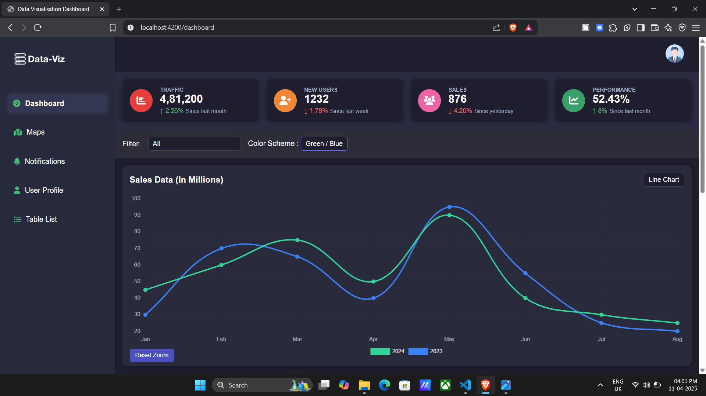
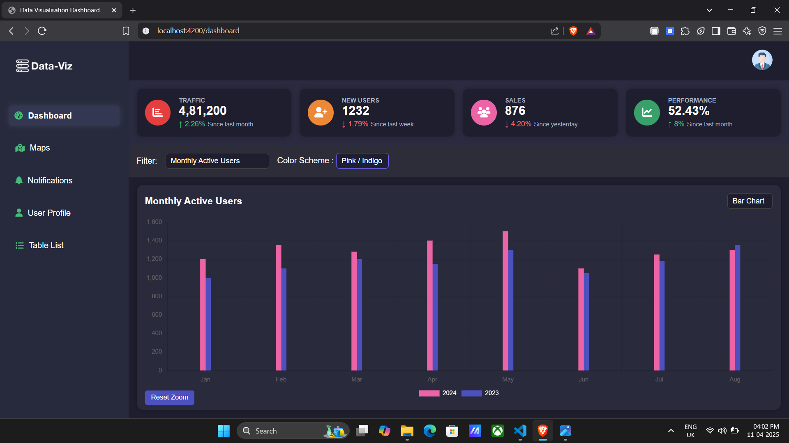
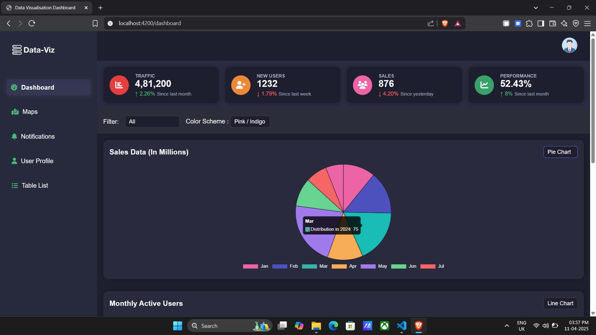
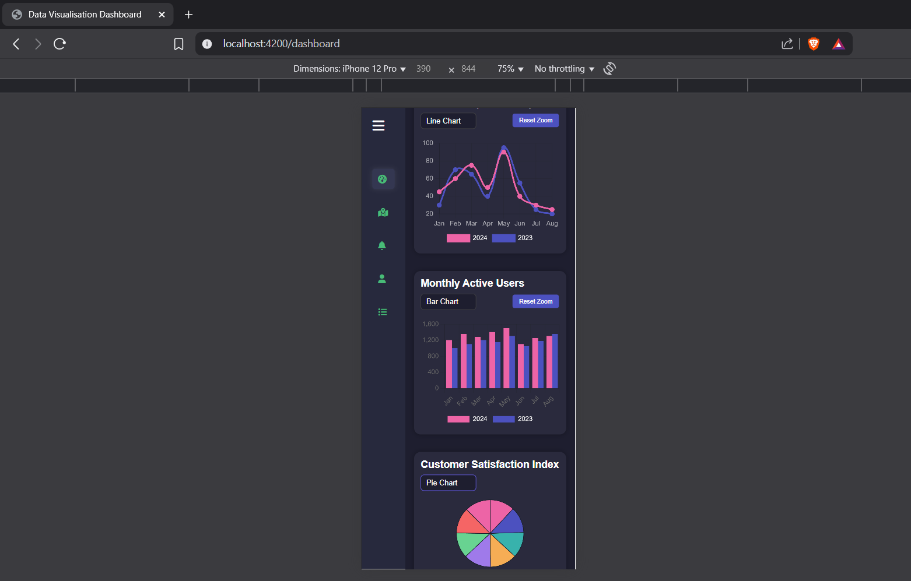

# 📊 Data Visualisation Dashboard

An interactive data visualisation dashboard built with **Angular 19**, **NgRx**, and **Chart.js**. The dashboard supports dynamic chart rendering, user-customisable themes, and real-time state-driven interactivity.

---

## ✨ Key Features
📈 Dynamic Chart Rendering
Supports Line, Bar, and Pie charts with smooth transitions.

🎨 Theme Customisation
Change color schemes for individual charts via dropdowns.

🧠 NgRx State Management
Uses a centralised store to manage chart types, color schemes, and selected sections (sales, engagement, performance).

⚡ Real-Time Interactivity
Changes in dropdown filters immediately reflect on the charts without reloads.

🧪 Mock Data Integration
Charts are driven using dummy JSON datasets to simulate real-world data.

💻 Responsive Layout
Fully optimised for desktop and mobile views, including sidebar collapse for small screens.

---

## 🛠 Tech Stack

- **Angular 19**
- **NgRx Store & Effects**
- **Chart.js**
- **RxJS**
- **SCSS**

---
##  Screenshots








## 📦 Setup Instructions

### 1. Clone the Repository

```bash
git clone https://github.com/Muhammed-Ameen-22/data-visualisation-dashboard.git
cd data-visualisation-dashboard
````
### 2. Install Dependencies

```bash
npm install
````
### 3. Run the Server

```bash
ng serve
Then open your browser at: http://localhost:4200
```

